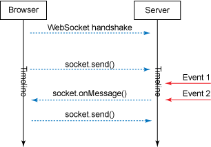

## 什么是 Web Sockets

Web Sockets 技术使得浏览器直接与服务器端的程序通过 socket 可以实时的推送或者获取信息的通讯方式成为可能。

在 HTML5 之前实现浏览器与服务器端实时通信的技术如下：

* 轮询：原理简单易懂，就是客户端通过一定的时间间隔以频繁请求的方式向服务器发送请求，来保持客户端和服务器端的数据同步。
* Flash：Flash 通过自己的 Socket 实现完成数据交换，再利用 Flash 暴露出相应的接口为 JavaScript 调用，从而达到实时传输目的。

## Web Sockets 的优势与劣势

### Web Sockets 的优势

* Web Sockets 提供强大的、双向、低延迟和易于处理的错误。
* 它没有很多连接，比如：Comet 长轮询。

### Web Sockets 的劣势

* Web Sockets 是 HTML5 的新规范，并不是所有浏览器都支持。
* 无请求作用域。由于 Web Sockets 是一个 TCP 套接字，而不是一个 HTTP 请求，因此无法轻松使用请求作用域服务。

## Web Sockets 的实现原理

下图展示了如何使用 WebSockets 进行通信：



1. HTTP 握手被发送到带有特定标头的服务器。
2. 在 JavaScript 的服务器或客户端上提供某种类型的套接字。
3. 使用该套接字来通过事件处理器异步接收数据。

## Web Sockets API

### Web Sockets 的构造函数

```javascript
var websocket = new WebSocket(url, protocols);
```

| 参数名称 | 描述 |
| --- | --- |
| url | 表示要连接的URL,这个URL应该是响应WebSocket的地址。|
| protocols | 单个协议名称或字符串数组,默认为空字符串。|

> **值得注意的是：**Web Sockets 的请求地址（url）必须是 `ws://` 或 `wss://`。

```javascript
var exampleSocket = new WebSocket("ws://www.example.com/socketserver");
```

### Web Sockets 的方法

| 方法名称 | 参数 | 描述 |
| --- | --- | --- |
| send(data) | data表示发送的请求数据。 | 通过 WebSocket 连接向服务器发送数据。|
| close() | | 关闭WebSocket连接或停止正在进行的连接请求。|

```javascript
exampleSocket.send("Here's some text that the server is urgently awaiting!");
```

### Web Sockets 的属性

Web Sockets 的属性主要使用的就是 `readyState`，该属性表示连接的当前状态。

| 常量名 | 值 | 描述 |
| --- | --- | --- |
| CONNECTING | 0 | 连接还没开启。|
| OPEN | 1 | 连接已开启并准备好进行通信。|
| CLOSING | 2 | 连接正在关闭的过程中。|
| CLOSED | 3 | 连接已经关闭，或者连接无法建立。|

### Web Sockets 的事件

| 事件名称 | 描述 |
| --- | --- |
| onopen | 用于监听 Web Sockets 打开的事件。|
| onmessage | 用于监听 Web Sockets 服务器端传递消息的事件。|
| onerror | 用于监听 Web Sockets 发生错误的事件。|
| onclose | 用于监听 Web Sockets 通信关闭的事件。|

### Web Sockets 使用步骤

```javascript
var ws = new WebSocket('ws://127.0.0.1:8080/async'); 
ws.onopen = function() { 
    // called when connection is opened 
}; 
ws.onerror = function(e) { 
    // called in case of error, when connection is broken in example 
}; 
ws.onclose = function() { 
    // called when connexion is closed 
}; 
ws.onmessage = function(msg) { 
    // called when the server sends a message to the client. 
    // msg.data contains the message. 
}; 
// Here is how to send some data to the server 
ws.send('some data'); 
// To close the socket:
ws.close();
```

## Web Sockets 案例

* 客户端代码示例：

```javascript
// 假设服务端ip为127.0.0.1
ws = new WebSocket("ws://127.0.0.1:2346");
ws.onopen = function() {
    alert("连接成功");
    ws.send('tom');
    alert("给服务端发送一个字符串：tom");
};
ws.onmessage = function(e) {
    alert("收到服务端的消息：" + e.data);
};
```

* 服务器端代码示例：

这里利用了 PHP 的第三方框架 Workerman 实现 Web Sockets 的服务器端逻辑。

```php
<?php
use Workerman\Worker;
require_once '/Workerman/Autoloader.php';

// 创建一个Worker监听2346端口，使用websocket协议通讯
$ws_worker = new Worker("websocket://0.0.0.0:2346");

// 启动4个进程对外提供服务
$ws_worker->count = 4;

// 当收到客户端发来的数据后返回hello $data给客户端
$ws_worker->onMessage = function($connection, $data)
{
    // 向客户端发送hello $data
    $connection->send('hello ' . $data);
};

// 运行worker
Worker::runAll();
?>
```