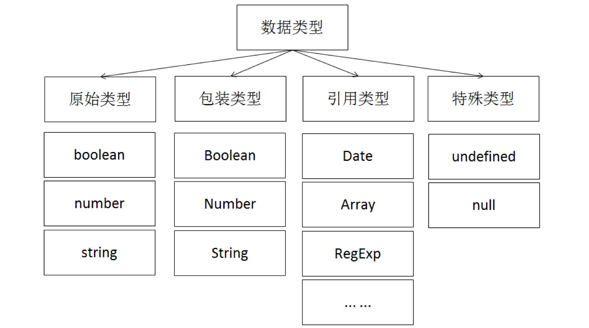

在 JavaScript 代码中，能够表示并操作值的类型称之为**数据类型**。

数据类型可分为可变类型和不可变类型。可变类型的值是可修改的，对象和数据就属于可变类型；不可变类型的值是不可修改的，数字、布尔值、null 和 undefined 都属于不可变类型。

字符串可以看成由字符组成的数组，可能被误认为是可变的。但在 JavaScript 中，字符串的值是不可变的。



## 原始类型

原始类型，又称为原始值，是直接代表 JavaScript 语言实现的最底层的数据。

原始类型分别为 boolean 类型、number 类型和 string 类型三种。当然，有些资料将undefined 和 null 也归为原始类型（这里表示为特殊类型）。

声明变量并初始化值为原始类型，一般称之为字面量方式定义变量，也可以称之为直接量方式定义变量。

## boolean 类型

布尔（boolean）类型是指真或假、开或关、是或否。这个类型只有两个值：true 和 false。

> **值得注意的是:**
> 
> - 由于 JavaScript 是区分大小写的，布尔类型的 true 和 false 全部是小写。
> - JavaScript 也可以将其他类型的数据，自动转换为布尔类型。

| 数据类型 | 转换为 true 的值 | 转换为 false 的值 |
| --- | --- | --- |
| boolean类型 | true | false |
| string类型 | 任何非空字符串 | “”（空字符串）|
| number类型 | 任何非零数字值（包括无穷大）| 0和NaN |
| object类型 | 任何对象 | null |
| undefined | | undefined |

## number 类型

number 类型是指数字，JavaScript 不区分整数类型和浮点类型。

- 整数类型: 包括负整数、0和正整数等。
- 浮点类型: 表示小数，JavaScript 中的所有数字均用浮点类型表示。

> **值得注意的是:** 八进制或十六进制的数值最终会被转换成十进制数值。

## 浮点类型

浮点类型，就是指该数值包含整数部分、小数点和小数部分。

```javascript
var floatNum1 = 0.1;
var floatNum2 = .1;// 有效，但不推荐
```

> **值得注意的是:**
> 
> - JavaScript允许小数点前可以没有整数，但不推荐这种写法。
> - 保存浮点类型需要的空间是保存整数类型的两倍。
> - 如果小数点后面没有任何数字，那这个数值作为整数类型保存。

```javascript
var floatNum3 = 1.;// 小数点后面没有数字 —— 解析为 1
var floatNum4 = 10.0;// 整数 —— 解析为 10
```

### 四舍五入误差

整数有无数个，但JavaScript通过浮点类型只能表示有限的个数（确切地说是 18 437 736 874 454 810 627个）。也就是说，当在JavaScript中使用浮点类型时，常常只是真实值的一个近似表示。如下述代码:

```javascript
var x = .3 - .2;
var y = .2 - .1;
x == y;// 值为false，表示两值不相等
x == .1;// 值为false，.3-.2 不等于 .1
y = .1;// 值为true，.2-.1 等于 .1
```

> **值得注意的是:** 建议使用大整数表示金额。例如使用分作为单位，而不是使用元作为单位。

### NaN

NaN（Not a Number），即非数值，是一个特殊的数值。

特点:

- 任何涉及NaN的操作都会返回NaN。
- NaN与任何值都不相等，包括NaN本身。

> **值得注意的是:** 针对上述特点，JavaScript提供了isNaN( )函数。该函数用于判断计算结果是否为数值。

```javascript
console.log(isNaN(10));// 输出false（10是一个数值）
console.log(isNaN("10"));// 输出false（可以被转换成数值 10）
console.log(isNaN("blue"));// 输出true（不能转换成数值）
console.log(isNaN(true));// 输出false（可以被转换成数值 1）
```

## string 类型

string 类型用于表示由零或多个 16 位 Unicode 字符组成的字符序列，被称之为字符串。字符串可以由双引号（"）或单引号（'）表示。

```javascript
var firstString = "Nicholas";
var secondString = 'Zakas';
```

string类型包含一些特殊的转义字符，用于表示非打印字符。

| 转义字符 | 含义 |
| --- | --- |
| \n | 换行符 |
| \t | 制表符 |
| \b | 退格符 |
| \r | 回车符 |
| \f | 换页符 |
| \\ | 斜杠 |
| \' | 单引号（'），在用单引号表示的字符串中使用。|
| \" | 双引号（"），在用双引号表示的字符串中使用。|

## typeof 运算符

由于 JavaScript 是弱类型/松散类型的，因此需要有一种手段来检测给定变量的数据类型。typeof 运算符就是负责提供这方面信息，如下述代码:

```javascript
var message = "this is message";
console.log(typeof message);// 输出 string
console.log(typeof(message));// 输出 string
```

> **值得注意的是:** typeof 运算符加上圆括号，会像是函数，而不是运算符，并不建议这种写法。

| 值 | 类型 |
| --- | --- |
| true或false | boolean |
| 任意数字或NaN | number |
| 任意字符串 | string |
| null | object |

## 包装类型

### 包装类型概述

在 JavaScript 中，对应原始类型提供了包装类型。通过包装类型可以创建原始类型的对象（后面的课程学习）。

由于 JavaScript 是区分大小写的，从写法上来说，原始类型是全部小写，包装类型则是全部大写。

一般不建议使用包装类型定义对应的数据类型，但包装类型提供了操作相应值的方法。

> **值得注意的是:** 包装类型涉及到对象的概念，具体技术内容会在后面的课程学习。

### Boolean 类型

Boolean 类型是原始类型 boolean 类型对应的包装类型。

```javascript
var bool = new Boolean(true);
```

boolean 类型与 Bollean 类型的区别:

- typeof 运算符对原始类型返回 "boolean"，而对包装类型为 "object"。
- instanceof 运算符测试 Boolean 类型返回 true，而测试 boolean 类型返回 false。

> **值得注意的是:** 不建议使用 Boolean 类型。

### Number 类型

Number 类型是原始类型 number 类型对应的包装类型。

```javascript
var num = new Number(10);
```

number 类型与 Number 类型的区别:

- typeof 运算符对原始类型返回 "number"，而对包装类型为 "object"。
- instanceof 运算符测试 Number 类型返回 true，而测试 number 类型返回 false。

> **值得注意的是:** 不建议使用 Number 类型。

### String 类型

String 类型是原始类型 string 类型对应的包装类型。

```javascript
var str = new String("hello world");
```

string 类型与 String 类型的区别:

- typeof 运算符对原始类型返回 "string"，而对包装类型为 "object"。
- instanceof 运算符测试 String 类型返回 true，而测试 string 类型返回 false。

> **值得注意的是:** 不建议使用 String 类型。

### instanceof 运算符

instanceof 运算符的左操作数是一个包装类型的变量，右操作数是对应的数据类型。如果左侧的变量是右侧的数据类型，则表达式返回 true；否则返回 false。例如下述代码:

```javascript
var str = "this is message";
str instanceof String;// 计算结果为 true, str是String类型
str instanceof Object;// 计算结果为 true, 所有包装类型都是Object的实例
str instanceof Number;// 计算结果为 false
```

> **值得注意的是:** 所有对象都是 Object 类型的实例对象，通过 instanceof 运算符判断一个对象是否为具体数据类型，也包含"父类"。（后面课程会学习）

## 特殊类型

### undefined

JavaScript 中有两个表示空的数据类型，undefined 和 null，其中比较有用的是 undefined。undefined 类型只有一个值，就是 undefined。

下列情况会返回undefined:

- 访问未修改的变量 undefined
- 没有定义 return 表达式的函数隐式返回 undefined
- return 表达式没有显式的返回任何内容
- 访问不存在的属性
- 任何被设置为 undefined 值的变量

### null

null 类型是 JavaScript 中的一个特殊类型，用于表示一个不再指向任何内存空间地址的变量。

null 值多用于释放 JavaScript 中的资源（变量、数组和函数等）。

> **值得注意的是:** 使用 typeof 运算符计算 null 的话，返回的是 object。

```javascript
var atguigu = null;
console.log(atguigu);// 输出 null
```

### undefined 与 null

- 共同点: 都是原始类型，保存在栈中。
- 不同点
	- undefined: 表示变量声明但未被赋值，是所有未赋值变量的默认值。一般很少主动使用。
	- null: 表示一个没有指向任何内存地址的变量，将来可能指向某个具体内存地址。一般用于主动释放资源。

## 类型转换

### 隐式类型转换

由于 JavaScript 是弱类型/松散类型的，在任何情况下都可以强制转换。

- 转换为字符串: 将一个值加上空字符串可以轻松转换为字符串类型。

```javascript
'' + 10 === '10'; // true
```

- 转换为数字: 使用一元的加号操作符，可以把字符串转换为数字。

```javascript
+'10' === 10; // true
```

- 转换为布尔值: 使用否操作符两次，可以把一个值转换为布尔型。

```javascript
!!'foo'; // true
```

### 显式类型转换

- 使用 JavaScript 的包装类型的构造函数进行类型转换。

| 构造函数 | 描述 |
| --- | --- |
| Number() | 将字符串或布尔值转换为数字，如果包含非法字符，则返回NaN。|
| String() | 将数字或布尔值转换为字符串。|
| Boolean() | 将字符串或数字转换为布尔值。|

- 使用数据类型的转换函数进行类型转换。

| 构造函数 | 描述 |
| --- | --- |
| toString() | 将数字或布尔值转换为字符串。|
| parseInt() | 将字符串或布尔值转换为整数类型。|
| parseFloat() | 将字符串或布尔值转换为浮点类型。|