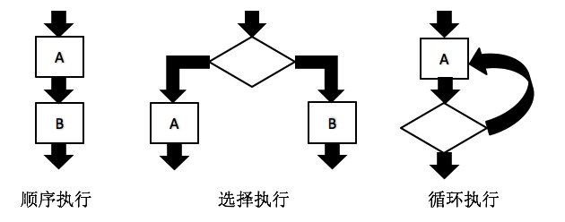
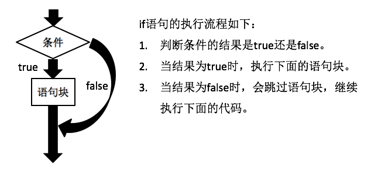
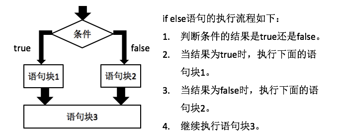
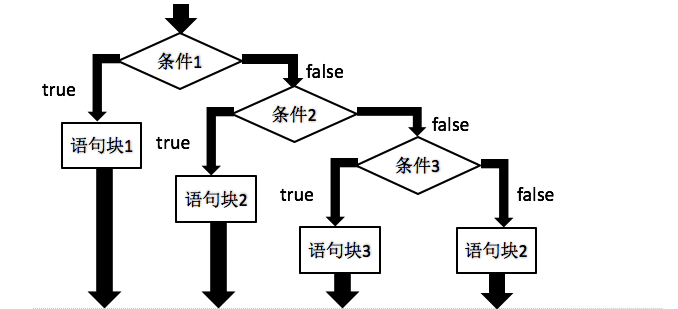
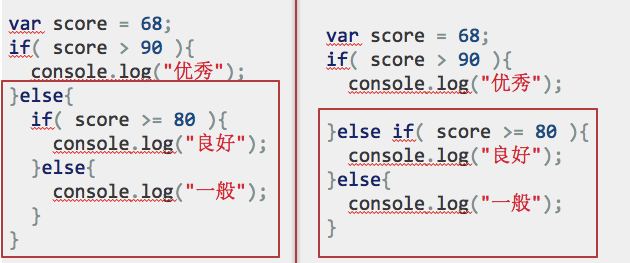
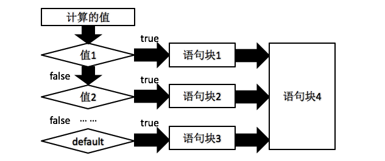
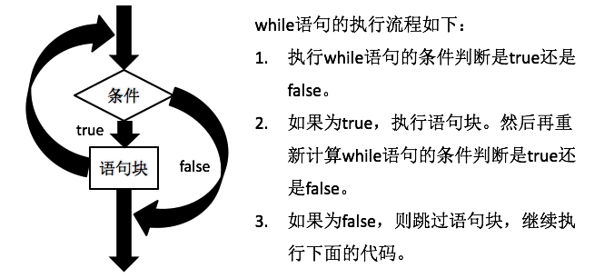
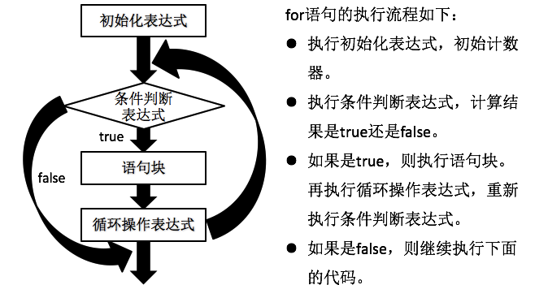

在 JavaScript 中，语句使用分号（;）进行分隔。可以在每行编写一条语句，也可以在每行编写多条语句。

分类:

- 条件语句: JavaScript 解释器根据一个值判断是执行还是跳过指定语句。
- 循环语句: JavaScript 解释器根据一个值判断是否重复执行指定语句。
- 跳转语句: 使 JavaScript 解释器跳转到指定语句。

> **值得注意的是:** 
> 
> - 建议每行编写一条语句，便于提高代码的阅读性。
> - JavaScript解释器按照语句的编写顺序依次执行。

### 语句块

JavaScript 中使用一对花括号（{}）表示一个语句块。使用语句块为语句进行分组，这样使语句的结构清晰明了。如下述代码:

```javascript
{
	var arguigu = "arguigu";
	console.log(arguigu);
}
```

> **值得注意的是:**
> 
> - 语句块的结尾不需要分号。
> - 语句块中的行都有缩进，但并不是必需的。
> - 语句中声明变量是全局变量（后面的课程学习）。

### 空语句

空语句允许包含 0 条语句，JavaScript 解释器执行空语句时，不会执行任何动作。空语句如下述代码:

```javascript
;
```

> **值得注意的是:** 如果有特殊目的使用空语句时，最好在代码中添加注释。这样可以更好地说明这条空语句是有用的。

### 流程控制语句

JavaScript 解释器按照语句的编写顺序依次执行，但也可以编写一些复杂的语句块，基本分为下述三种:



## 条件语句

条件语句就是指通过判断指定的计算结果，来决定是执行还是跳过指定的语句块。

如果说 JavaScript 解释器是按照代码的“路径”执行的话，那条件语句就是这条路径上的分叉点，代码执行到这里时必须选择其中一条路径继续执行。

JavaScript 提供了两种条件语句：if else 语句和 switch case 语句。

### if 语句

if 语句是条件判断语句，也是最基本的流程控制语句。



```javascript
var num = 5;
if( num < 10 ){
	console.log( num );
}
```

> **值得注意的是:**
> 
> - if 关键字后面的小括号不能被省略。
> - if 关键字后面的条件判断的结果必须是布尔值。如果结果为非布尔值的话，JavaScript 会自动转换为布尔值。
> - if 语句中的大括号（{}）可以被省略，但建议编写，以提高代码阅读性。

### if else 语句

if else 语句是条件判断语句，但与 if 语句的执行流程并不相同。


```javascript
var score = 68;
if( score < 60 ){
	console.log("不及格");
}else{
	console.log("及格");
}
```

> **值得注意的是:** if else 语句中的大括号（{}）可以被省略，但建议编写，以提高代码阅读性。

### if else 语句嵌套

if else 语句支持嵌套写法，也就是说，可以在 if 或 else 后面的语句块中继续编写 if else 语句。如下述代码:

```javascript
var score = 68;
if( score > 90 ){
	console.log("优秀");
}else{
	if( score >= 80 ){
		console.log("良好");
	}else{
		console.log("一般");
	}
}
```

### else if 语句

else if 语句是在 if 语句的基础上，允许提供多个条件判断。


else if 语句实际上就是简化了的 if else 语句的嵌套写法。如下述代码:



### switch case 语句

switch case 语句是开关语句，但整体执行流程要比 if else 语句复杂的多。具体参考下述流程图:



```javascript
var num = 2;
switch( num ){
	case 1:
		console.log("查询余额");
		break;
	case 2:
		console.log("在线充值");
		break;
	default:
		console.log("转人工服务");
}
```

> **值得注意的是:** 在实际开发中，switch case 语句与 break 语句同时使用。

switch case 语句相对于 if else 语句执行性能更优，但也有很多需要注意的地方。

> **值得注意的是:**
> 
> - switch 关键字后面的小括号、case 关键字后面的冒号都不能被省略的。
> - default 关键字只能出现在 switch case 语句的最后面（default 关键字后面不能再出现 case 关键字）。
> - break 语句是跳出语句，一旦被执行，表示后面所有的 case 和 default 语句都不会被执行。

## 循环语句

循环语句是一系列反复执行到复合特定条件的语句。为了更好地理解循环语句，可以将 JavaScript 代码想象成一条条的分支路径。循环语句就是代码路径中的一个回路，可以让一段代码重复执行。


### while 语句

while 语句是一个基本循环语句，语法结构与 if 语句很类似。


```javascript
var num = 0;
while( num < 10 ){
	console.log( num );
	num = num + 1;
}
```

> **值得注意的是:**
> 
> - while 关键字后面的小括号不能被省略。
> - while 关键字后面的条件判断的结果必须是布尔值。如果结果为非布尔值的话，JavaScript 会自动转换为布尔值。
> - while 语句中的大括号（{}）可以被省略，但建议编写，以提高代码阅读性。

### do while 语句

do while 语句也是一个基本循环语句，执行流程与 while 语句很类似。


```javascript
var num = 0;
do{
	console.log( num );
	num = num + 1;
}while( num < 10 );
```

> **值得注意的是:**
> 
> - while 关键字后面的小括号不能被省略。
> - while 关键字后面的条件判断的结果必须是布尔值。如果结果为非布尔值的话，JavaScript 会自动转换为布尔值。
> - do while语句中的大括号（{}）可以被省略，但建议编写，以提高代码阅读性。

### do while 与 while 语句的区别

do while 语句与 while 语句的差别极小:

- do while 语句: 先执行，再判断。
- while 语句: 先判断，再执行。

当 while 关键字后面的条件第一次被执行的时候，如果返回结果是 false 的话：while 语句的语句块一次都不会被执行；而 do while 语句的语句块至少被执行一次。

### for 语句

for语句是一种最简洁的循环语句，其中包含三个重要部分:

- 初始化表达式: 初始化一个计数器，在循环开始前计算初始状态。
- 条件判断表达式: 判断给定的状态是否为true。如果条件为true，则执行语句块，否则跳出循环。
- 循环操作表达式: 改变循环条件，修改计数器的值。

for 语句的语法如下:

```javascript
if( 初始化表达式; 条件判断表达式; 循环操作表达式 ){
	语句块
}
```



### for 语句的特殊用法

for 语句的三个表达式都是允许为空的。

- 初始化表达式为空的情况:

```javascript
初始化表达式
if( ; 条件判断表达式; 循环操作表达式 ){
	语句块
}
```

- 循环操作表达式为空的情况:

```javascript
if(初始化表达式; 条件判断表达式; ){
	语句块
	循环操作表达式 
}
```

### 循环嵌套

循环嵌套就是在一个循环语句中包含另一个循环语句。

```javascript
for( var i = 1; i < 10; i++ ){
	for( var j = 1; j <= i; j++ ){
		console.log(i + "*" + j + "=" + (i*j));
	}
}
```

> **值得注意的是:** JavaScript 中对循环嵌套的层级没有任何限制。但一般建议循环嵌套三层，不然执行的性能会下降。

## 跳转语句

JavaScript 中另一种语句就是跳转语句。从名称就可以看出，它使得 JavaScript 代码的执行可以从一个位置到另一个位置。

跳转语句提供了 break 和 continue 两种，用于跳转当前的循环或开始下一次的循环等。

### break 语句

break 语句是中断语句，用于终止循环语句或开关语句。

- 终止循环语句，例如 while、do while 以及 for 语句等。

```javascript
for( var i = 0; i < 10; i++ ){
	if( i == 5 ){
		break;
	}
	console.log( i );
}
```

- 终止开关语句（switch case），具体内容参考《switch case语句》一章。

### continue 语句

continue 语句是连续语句，用于重新开始 while、do while 和 for 语句。

```javascript
for( var i = 0; i < 10; i++ ){
	if( i == 5 ){
		continue;
	}
	console.log( i );
}
```

上述代码的执行结果为 1 2 3 4 6 7 8 9。当 i 等于 5 时，结束本次循环，开始下一次的循环执行。